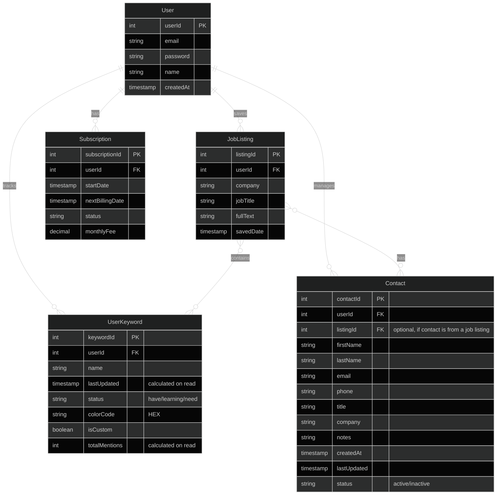

## Entity Relationship Diagram

```mermaid
%%{init: {'theme': 'dark', 'themeVariables': { 'primaryTextColor': '#ffffff', 'primaryColor': '#ffffff', 'noteBkgColor': '#2b2b2b', 'noteTextColor': '#ffffff' }}}%%
erDiagram
    User ||--o{ JobListing : saves
    User ||--o{ UserKeyword : tracks
    User ||--o{ Subscription : has
    User ||--o{ Contact : manages
    JobListing }o--o{ UserKeyword : contains
    JobListing }o--o{ Contact : has
    
    User {
        int userId PK
        string email
        string password
        string name
        timestamp createdAt
    }
    
    Subscription {
        int subscriptionId PK
        int userId FK
        timestamp startDate
        timestamp nextBillingDate
        string status
        decimal monthlyFee
    }
    
    JobListing {
        int listingId PK
        int userId FK
        string company
        string jobTitle
        string fullText
        timestamp savedDate
    }
    
    UserKeyword {
        int keywordId PK
        int userId FK
        string name
        timestamp lastUpdated "calculated on read"
        string status "have/learning/need"
        string colorCode "HEX"
        boolean isCustom
        int totalMentions "calculated on read"
    }

    Contact {
        int contactId PK
        int userId FK
        int listingId FK "optional, if contact is from a job listing"
        string firstName
        string lastName
        string email
        string phone
        string title
        string company
        string notes
        timestamp createdAt
        timestamp lastUpdated
        string status "active/inactive"
    }
```